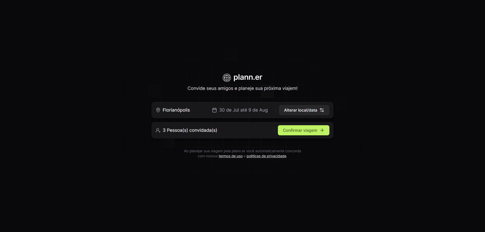

<h1 align="center"> NLW Journey </h1>

Evento exclusivo e gratuito, promovido pela Rocketseat para ensino de tecnologias WEB.

  <a href="#-tecnologias">Tecnologias</a>&nbsp;&nbsp;&nbsp;|&nbsp;&nbsp;&nbsp;
  <a href="#-projeto">Projeto</a>&nbsp;&nbsp;&nbsp;|&nbsp;&nbsp;&nbsp;
  <a href="#-layout">Layout</a>&nbsp;&nbsp;&nbsp;|&nbsp;&nbsp;&nbsp;
  <a href="#memo-licença">Licença</a>

  

  
  

 

## 🚀 Tecnologias

  Esse projeto foi desenvolvido com as seguintes tecnologias:

    
    
    
    
    
    

## 💻 Projeto

  O projeto é um site responsivo para montar um roteiro de viagem, cadastrando atividades.  
  Esse é um dos projetos do evento NLW Journey, um dos conteúdos disponíveis para alunos da Rocketseat.

## 🔖 Layout

  Você pode visualizar o layout do projeto através <a href="https://www.figma.com/community/file/1392277205162897872">Deste Link</a>. É necessário ter conta no <a href="https://figma.com">Figma</a> para acessá-lo.

## :memo: Licença

  Esse projeto está sob a licença MIT.
</a>

---

  Feito com 💜 by Rocketseat :wave: [Participe da nossa comunidade!] <a href="https://discord.gg/rocketseat">Participar</a>

